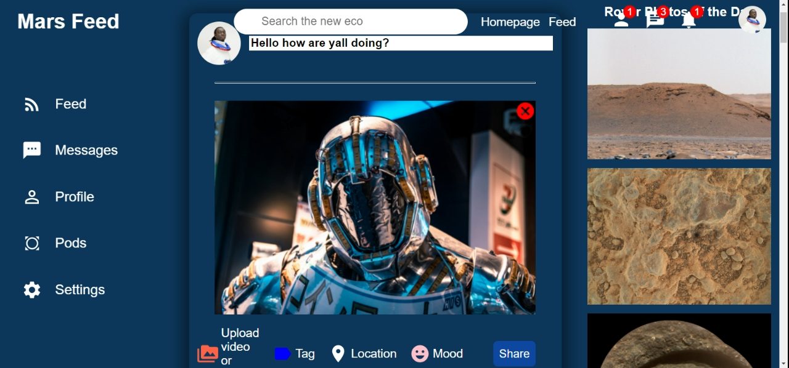
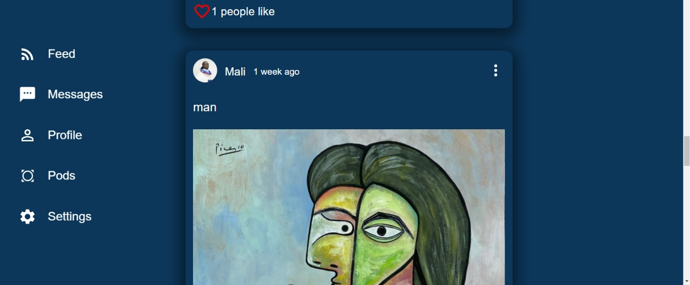

# Mars Feed

A social media app for a Mars colony. Features a full-stack application with a feed that automatically updates. Also, users can upload images, like posts, follow friends, and unfollow friends. 

- Created using the MERN stack. 

## Features

- React
- MongoDB
- Express
- Dotenv
- Hemlet
- Morgan
- Nodemon
- Mongoose

## Testing

Used Postman  Api to test backend requests. 

### More pictures

